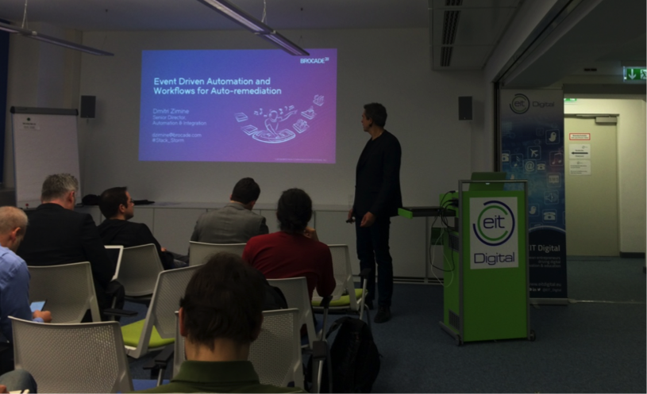
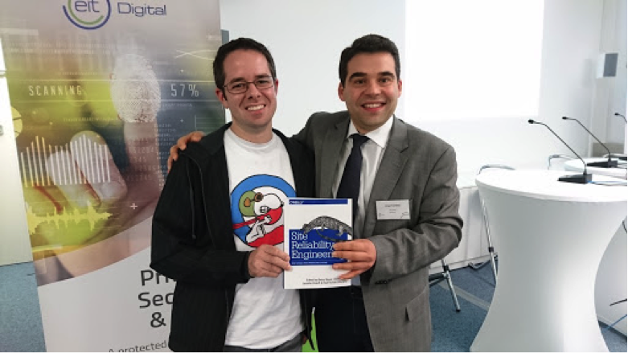

The International Industry-Academia Workshop on Cloud Reliability and Resilience was held in Berlin on 7-8 November 2016. The workshop gathered close to 50 participants from industry (Intel, Red Hat, CISCO, SAP, Google, LinkedIn, Microsoft, Mirantis, Brocade, T-Systems,
SysEleven, Deutsche Telekom, Flexiant, Hastexo) and academia (TU Wien, TU Berlin, U Oxford, ETH, U Stuttgart, TU Chemnitz, U Potsdam, TU Darmstadt, U Lisbon, U Coimbra).

During two days, modern approaches for managing the reliability and resilience of cloud platforms and large-scale systems were discussed. The main topics under scrutiny were focused on site reliability engineering, fault injection testing, auto remediation, cloud
standards, and dependable cloud storage. 

Dmitri Zimine (Brocade) giving his speech on workflows for auto-remediation (credits to Johannes Weingart).

The workshop also gathered a panel titled "What's next for Cloud Reliability and Resilience: Challenges, Opportunities, Technologies, Theories, and More...” moderated by Dr. Goetz Brasche (Huawei), with the participation of Dr. Goetz Reinhaeckel (T-Systems), Dmitri Zimine (Brocade), Prof. Alysson Bessani (U Lisbon), and Sebastian Kirsch (Google).

During the workshop, participants agreed that reliability and resilience are having an increasing importance for companies operating large-scale or planet-scale systems. Well-known service providers such as LinkedIn, Google, Uber, Dropbox, Salesforce, Netflix, and New Relic are all adopting concepts borrowed from Site Reliability Engineering (SRE), and have developed homegrown frameworks, techniques, and tools to run numerous services as efficiently and reliably as possible. Examples of techniques that were discussed
include fault injection testing, workflows for auto remediation, and the use of multiple clouds to build dependable storage. Areas of interest which still need to be explored in the future include service level objectives and agreements, real-time monitoring and analytics, failure prediction, predictive maintenance, and automated recovery.

Sebastian Kirsch (Google), co-author of the bestselling book Site Reliability Engineering from Google, and the workshop organizer Jorge Cardoso (Huawei).

The presentations covered the following topics:

+ Building Blocks for Site Reliability, Sebastian Kirsch, Google, Switzerland.
+ Breaking Azure for Fun and Profit, Pavel Michailov, Microsoft, US.
+ Using Event-driven Automation and Workflows for Auto-remediation, Dmitri Zimine, Brocade, US.
+ High Availability and Disaster Recovery in OpenStack: From humble beginnings to enterprise reliability, Florian Haas, Hastexo, Austria.
+ A Tale of Ice and Fire, or: The Cloud and the Standards, Michel Drescher, University of Oxford, UK.
+ I'm No Hero: Full Stack Reliability at LinkedIn, Todd Palino, LinkedIn, US.
+ Dependable Storage and Computing using Multiple Cloud Providers, Alysson Neves Bessani, University of Lisbon, Portugal.
+ Cloud Based Fault Injection for Anomaly Detection, Craig Sheridan, flexiOPS, UK.

We would like to express our thanks, first of all, to the invited speakers for sharing their expertise with the audience. They were keystones of the program that we believe was exciting and of high quality. Next, we would like to thank the steering committee, who helped us with strategic guidance. Special thanks should be addressed to the organization and sponsorship of the event made by EIT Digital and Huawei German Research Center.

General Chair,

Prof. Jorge Cardoso, Huawei GRC, Germany

