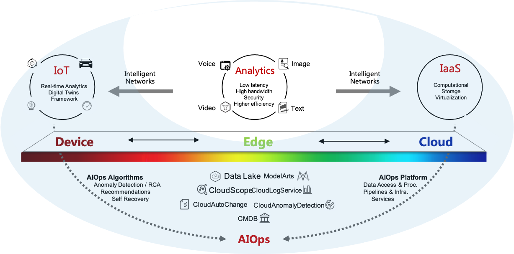

I currently lead the **Ultra-scale AIOps Lab** and I take a dual role of Chief Architect and Engineer Manager at the 
[Huawei Munich Research Center](http://www.huawei.eu/research-and-innovation) in Munich, Germany and [Huawei Ireland Research Center](https://huawei.eu/what-we-do/digital-transformation) in Dublin, Ireland.

You can find more information about our work:
+ [Cloud Operation R&D](/pdf/2023-05-23-AS_AIOps_for_Cloud_Operations_R&D.pdf), May 23-25 2023, Academic Salon AIOps 2023, TU Berlin.
+ [Research Contributions](/pdf/2022-03-30-DRCN_On_the_Application_of_AI_for_Failure_Management.pdf), March 28-31 2022, [18th DRCN](https://www.drcn2022.upc.edu/65183/detail/drcn-2022.html)
+ [Lab presentation](/pdf/2021-07-29-Ultra_Scale_AIOps_Lab_Workshop.pdf), July 2021, [The 1st Network Verification Workshop](https://networkverification-workshop.github.io/)

Many of our innovation and system developments is done in collaboration with the [Technical University of Berlin](https://www.dos.tu-berlin.de/menue/datesnews/news/huawei_tub_innovation_lab_kick_off/) and the Huawei-TUB Innovation Lab for AI-driven Autonomous Operations.

Using machine learning and deep learning techniques, we apply AI to various areas related to [HUAWEI CLOUD](https://www.huaweicloud.com/intl/en-us/) such as: anomaly detection, root cause analysis, failure prediction, reliability and availability, risk estimation and security, network verification, and low-latency object tracking. Our work fits under the AI Engineering umbrella as discussed in [IEEE Software, Nov.-Dec. 2022](https://www.computer.org/csdl/magazine/so/2022/06).

The areas are categorized in three fields:

+ **AI for Operations**. We apply analytics and machine learning (ML) techniques to automate IT operations and maintenance. We collect operational data from IT infrastructures, leverage big data and AI platforms to automatically detect and predict failures in datacenters and cloud platforms in real-time. 

+ **Edge AI**. We bring ML algorithms, computation and data storage closer to the devices where data is generated. This local computation allows to process data in devices with a low latency. Examples of use cases include video surveillance and  health monitoring. 

+ **AI for Networks**. We leverage ML to automate routine tasks, such as network verification, configuration, optimization and troubleshooting. The new algorithms and tools developed provide network operators and architects with key network insights and actionable information.  

+ **AI for DevOps**. We are also exploring the area of AI for DevOps to determine how AI can be leveraged to improve configuration management, continuous verification, service management, scalability analysis, etc. 

Another field of interest is **customer intelligence** which analyzes the activities and interactions executed by customers when using cloud services. Important types of analysis include usage patterns identification, churn analysis, and automated customer support for diagnose and repair. 

AI for Operations
-----------------

Our current research involves the development of the **next generation of AI-driven IT Operations tools and platforms**.
This field is generally called [AIOps](https://pt.slideshare.net/JorgeCardoso4/mastering-aiops-with-deep-learning) 
(artificial intelligence for IT operations).
In planet-scale deployments, the Operation and Maintenance (O&M) of cloud platforms cannot be done any longer manually
or simply with off-the-shelf solutions. 
It requires self-developed automated systems, ideally exploiting the use of AI to provide tools for autonomous cloud operations. Our research looks into how **deep learning**, **machine learning**, **distributed traces**, **graph analysis**, **time-series analysis** (sequence analysis), and **log analysis** can be used to effectively **detect and localize anomalous cloud infrastructure behaviours** during operations to reduce the workload of human operators. 
These techniques are typically applied to Big Data coming from 
microservice [observability data](https://www.mstakx.com/wp-content/uploads/2018/09/A-Practical-Observability-Primer-1.pdf).

We create innovative systems for:

+ **Service health analysis**: Resource utilization (e.g., memory leaks), anomaly detection using KPI and logs
+ **Predictive analytics**: fault prevention, SW/HW failure prediction  
+ **Automated recovery**: fault localization and recovery
+ **Operational risk analysis**: CLI command analysis

We are currently developing the iForesight system which is being used to evaluate this new O&M approach. 
[iForesight 5.0](/projects/iforesight) is the result of more than 3 years of R&D with
the goal to provide an intelligent new tool aimed at [SRE](https://en.wikipedia.org/wiki/Site_Reliability_Engineering)
cloud maintenance teams. 
It enables them to quickly detect, localize and predict anomalies thanks to the use of artificial intelligence when
cloud services are slow or unresponsive. 

We have already published several papers in this field: 

+ [Self-Attentive Classification-Based Anomaly Detection in Unstructured Logs](/publications/Papers/CP-2020-094-ICDM_Self_Attentive_Classification_Based_Anomaly_Detection.pdf)
Nedelkoski, S.; Bogatinovski, J.; Acker, A.; Cardoso, J. and Kao, O.
In 20th IEEE International Conference on Data Mining (ICDM), Italy, 2020.
**(Conference Rank: A*)**
+ [Self-Supervised Log Parsing](/publications/Papers/CP-2020-095_ECML_Self_Supervised_Log_Parsing.pdf)
Nedelkoski, S.; Bogatinovski, J.; Acker, A.; Cardoso, J. and Kao, O.
In European Conf. on Machine Learning and Principles and Practice of Knowledge Discovery in Databases (ECML-PKDD), Belgium, 2020.
**(Conference Rank: A)**
+ [Anomaly Detection and Classification using Distributed Tracing and Deep Learning](/publications/Papers/CP-2019-089-CCGrid-Anomaly_Detection_and_Classification_using_DT_and_DL.pdf)
Nedelkoski, S.; Cardoso, J. and Kao, O.
In 19th IEEE/ACM International Symposium on Cluster, Cloud and Grid Computing ([CCGrid2019](https://www.ccgrid2019.org)), Cyprus, 2019.
**(Conference Rank: A)**
+ [Anomaly Detection from Systegridm Tracing Data using Multimodal Deep Learning](/publications/Papers/CP-2019-090-IEEECloud-Anomaly_Detection_from_System_Tracing_Data_and_MDL.pdf)
Nedelkoski, S.; Cardoso, J. and Kao, O.
[IEEE Cloud 2019](http://conferences.computer.org/cloud/2019/), Italy, 2019.
**(Acceptance Rate: 21%)**
+ [Self-Supervised Anomaly Detection from Distributed Traces](a)
J. Bogatinovski, S. Nedelkoski, J. Cardoso, and O. Kao.
In 2020 IEEE/ACM 13th International Conference on Utility and Cloud Computing (UCC). 2020.
+ [A Systematic Mapping Study in AIOps](/publications/Papers/WP-2020-079-AIOPS2020_A_Systematic_Mapping_Study_in_AIOps.pdf)
Notaro, P.; Cardoso, J. and Gerndt, M.
In [AIOPS 2020](https://aiopsworkshop.github.io/), International Workshop on Artificial Intelligence for IT Operations,
Dubai, 2020.
+ [Online Memory Leak Detection in the Cloud-based Infrastructures](/publications/Papers/WP-2020-078-AIOPS2020_Online_Memory_Leak_Detection.pdf)
Jindal, A.; Staab, P.; Cardoso, J.; Gerndt, M. and Podolskiy, V.
In [AIOPS 2020](https://aiopsworkshop.github.io/), International Workshop on Artificial Intelligence for IT Operations,
Dubai, 2020.
+ [Multi-source Distributed System Data for AI-Powered Analytics](/publications/Papers/CP-2020-093-Multi-source_Distributed_System_Data.pdf)
Nedelkoski, S.; Bogatinovski, J.; Mandapati, A. K.; Becker, S.; Cardoso, J. and Kao, O.
In Service-Oriented and Cloud Computing (ESOCC 2020), online, 2020.
+ [Towards Occupation Inference in Non-instrumented Services](/publications/Papers/CP-2019-092-IEEE_NCA_Towards-Occupation-Inference-in-Non-instrumented-Services.pdf)
Filipe, R.; Correia, J.; Araujo, F. and Cardoso, J.
In IEEE 18th International Symposium on Network Computing and Applications (NCA), online, 2019.

In 2020 we organized an international workshop on AIOps which we plan to repeat in 2021

+ AIOPS 2020 International Workshop on Artificial Intelligence for IT Operations, 18th International Conference on Service Oriented Computing, Dubai Virtual, 14 December 2020.

Edge AI
-------

In recent years, cloud computing has become a central part of the AI evolution. To better address requirements, businesses are becoming aware of the need to bring the technology closer to customers. Thus, Edge AI is emerging as a solution that uses ML to process data generated at the local level. The market is expected to grow in value from [$355 million in 2018 to $1.12 trillion by 2023](https://www.marketwatch.com/press-release/global-edge-ai-software-market-size-share-to-expand-at-203-cagr-through-2027-2021-03-18?tesla=y). 

Cloud-centric approaches face several limitations such as network latency and bandwidth constraints. While the edge model considerably reduces transmission costs and latency requirements, it raises questions with respect to computational models, system architectures, AI pipelines and reliability concerns. An example of this technology is Amazon Alexa which learns and stores phrases locally using AI. When a user gives a verbal command, the device sends the voice recording to an edge network where it is transformed to text using AI algorithms. Without an edge network, the response time would be seconds, with edge the latency is reduced to <400 ms. As another example, [Intelligent EdgeFabric](https://support.huaweicloud.com/intl/en-us/productdesc-ief/ief_productdesc_0001.html) provides a complete edge computing solution, in which cloud applications are extended to the edge. Edge nodes and applications can be managed remotely (e.g., device monitoring, application monitoring, and log collection) and data processed localy. [Edge-cloud solutions](https://www.huaweicloud.com/intl/en-us/solution/edgecloud.html) leverage public cloud infrastructures and edge services. 

As a starting point, our project relies on a use case from the field of [Smart Logistics](https://www.huaweicloud.com/intl/en-us/solution/logistics/) and [Video Analytics](https://www.mdpi.com/2078-2489/12/1/14). It involves multi-camera surveillance systems, OCR and real-time object tracking. The cameras monitor containers in a transportation chain, while ML compiles data in real time for the container tracking process. The use case is used to identify new computational models at the edge. It is implemented to demonstrate how edge platforms should be designed to manage AI-driven applications.

To support the reference use case, data needs are collected, stored, processed, analysed, and visualized across the distributed components of edge platforms using AI. The implementation supports training, deployment, and inferencing ML models optimized to provide services with low latency for end users. The output is a set of new computing models, training/inference patterns and libraries/algorithms.  

The final system will be used to experiment and evaluate various computational models and architecture configurations, derive latency and bandwidth constraints, and explore how high levels of reliability can be achieved. Afterwards, the findings, namely the new computing models identified, will be translated into new functionalities of the open source software framework [Sedna](https://github.com/kubeedge/sedna) and [Kubeedge](https://github.com/kubeedge/kubeedge).

Our approach leverages the following techniques: 

+ [Architectures for deep learning inference](http://www.cs.ucr.edu/~jiasi/pub/deep_edge_review.pdf)
+ [Training and inference at the edge](https://arxiv.org/abs/1907.08349)
+ Model selection, pruning, quantization, scarification, parameter tuning, offloading, partitioning, caching, etc.
+ [DL models](https://github.com/onnx/models): CNN, LSTM, AlexNet, Yolo, MXNet, GoogleNet, etc.
+ [Sedna Open source Edge AI frameworks](https://github.com/kubeedge/sedna)

Facebook has written a very interesting paper on [Understanding Inference at the Edge](https://research.fb.com/wp-content/uploads/2018/12/Machine-Learning-at-Facebook-Understanding-Inference-at-the-Edge.pdf)([slides](https://amld-prd.s3.eu-central-1.amazonaws.com/qwe1xb1o1w5361n7ut10q2keqv4o)).
The main proposition is that AI models are currently trained in datacenters, but to improve user experience models need to run at the edge. This will enable a lower  latency and lower dependency on network connectivity. Vertical integration is key.

Another interesting example of Edge AI (Device AI may be a better term) comes from Google. [GBoard](https://en.wikipedia.org/wiki/Gboard) is a smartphone keyboard software that does not use centralized retraining of AI models. Instead, smartphones retrain local models and send model changes to a central system. Changes are integrated into a new model which is pushed back to customer devices. This federated learning approach guarantees privacy and a lower power consumption.

We have made the following presentation at KubeCon of our Edge AI system:

+ [Managing Large-Scale Edge Cluster Over Unstable Network with KubeEdge](https://www.lfasiallc.com/kubecon-cloudnativecon-open-source-summit-china/program/schedule/), Fei Xu, Huawei, December 9, 2021.

AI for Networks
---------------

Gartner research indicates that 70% of network operations are still performed manually. Other surveys indicate that misconfigurations are the root cause of 75% of network outages and performance issues. This leads to high MTTR (mean time to resolve) KPIs since problems are only observed in production. 

Thus, we are building a network monitoring and verification platform driven by AI for real-time intelligent network verification in cloud datacenters. 
Our work is related to Google [Network Intelligence Center](https://cloud.google.com/network-intelligence-center), formal verification at AWS ([Security](https://link.springer.com/chapter/10.1007/978-3-319-96145-3_3) and [Reachability](https://www.amazon.science/publications/debugging-network-reachability-with-blocked-paths)), template inference using [SelfStarter](http://web.cs.ucla.edu/~todd/research/nsdi20.pdf) and active monitoring using [Pingmesh](https://dl.acm.org/doi/pdf/10.1145/2785956.2787496), both from Microsoft.

Our approach leverages the following techniques: 

+ AI/ML
+ Mixed-integer/constraint programming and SAT constraint solvers
+ Network programmability and programmable switches
+ SmartNICS/FPGAs

As a step in the field of AI for Networks, we are organizing the [1st Network Verification Workshop](https://networkverification-workshop.github.io/) to provide a forum for the community to come together and rethink fundamental questions, breakthrough solutions in network verification in summer 2021.

AI for DevOps
-------------

We have developed an intelligent continuous verification tool to ensure software errors are not transferred to production. If a release verification fails, it is automatically kept out of production by doing a rollback. The tool determines whether or not a release can be pushed to production and requires little-to-no human intervention. 

We create innovative systems for:

+ **Intelligent coding**: logging recommendations, coding efficiency
+ **CI/CD**: continuous verification, configuration management
+ **Real-time debugging**: exception management 

In this field we have also done some preliminary work on process mining (e.g., Assessing Software Development Teams Efficiency using Process Mining, [International Conference on Process Mining](https://icpmconference.org), 2019, Germany)

. Bogatinovski, J.; Nedelkoski, S.; Acker, A.; Cardoso, J. and Kao, O. In 30th IEEE/ACM International Conference on Program Comprehension, 2022. [pdf, gs] [bib]

+ [QuLog: Data-Driven Approach for Log Instruction Quality Assessment](/publications/Papers/CP-2022-097_ICPC_QuLog.pdf)
Nedelkoski, S.; Bogatinovski, J.; Acker, A.; Cardoso, J. and Kao, O.
In 30th IEEE/ACM International Conference on Program Comprehension (ICPC), 2022.
**(Conference Rank: A)**

News
----
+ Our article *QuLog: Data-Driven Approach for Log Instruction Quality Assessment* was accepted to 30th IEEE/ACM International Conference on Program Comprehension (ICPC), Pennsylvania, 2022. **(Conference Rank: A)**
+ I will give a keynote talk on "On the Application of AI for Failure Management: Problems, Solutions and Algorithms" at the [18th International Conference on the Design of Reliable Communication Networks (DRCN)](https://www.drcn2022.upc.edu), March 28-31, 2022,Barcelona, Spain.
+ I will give a talk on "Towards Autonomous IT Systems: AIOps for IT Operations, Networks, Edge AI and DevOps" at [CASCON EVOKE 2021](https://pheedloop.com/casconevoke2021/site/home/), Toronto, Canada, November 22-26, 2021.
+ Unveiling process insights from refactoring practices, Computer Standards & Interfaces, Caldeira, Cardoso et al., 2021.
+ I will be part of a panel on *AI for Operations Management* at [IEEE SERVICES 2021](https://conferences.computer.org/services/2021/) with Fausto Bernardini, Sr. SRE Director @ Google, Adam 
  Iwanicki SRE Manager @ Google, Matt Lyteson, CTO @ IBM.
+ I will serve with Anup K. Kalia, IBM T. J. Watson Research Center, NY as Industrial Track Co-Chair for the *[19th edition of the International Conference on Service Oriented Computing (ICSOC 
  2021)](http://icsoc2021.josueonline.com/)*, November 22nd to 25th, Dubai. 
+ My Lecture on [AIOps: Anomalous Span Detection in Distributed Traces Using Deep Learning](https://www.slideshare.net/JorgeCardoso4/aiops-anomalous-span-detection-in-distributed-traces-using-deep-learning) presented at Prof. Joeran Beel's Chair (Intelligent Systems, Trinity College Dublin) on 02.10.2019 is now available.
+ Our article *Towards Occupation Inference in Non-instrumented Services* was accepted to IEEE Network Computing and Applications. Boston, MA, USA, September 2019.
+ Andre Pascoal Bento defended successfully his thesis [Observing and Controlling Performance in Microservices](projects/pdf_img/MSc_thesis_Andre_Bento.pdf)
+ Our article *On Black-Box Monitoring Techniques for Multi-Component Services* was accepted to [17th IEEE International Symposium on Network Computing and Applications (NCA)](http://www.ieee-nca.org/2018/), 1-3.10, 2018, Cambridge, US. **(Conference Rank: A)**
+ This year we are part of the Program Committee of [SREcon 2019](https://www.usenix.org/conference/srecon19emea/), 2–4 October, 2019, Dublin, Ireland.
+ Jorge Cardoso [Mastering AIOps with Deep Learning](https://pt.slideshare.net/JorgeCardoso4/mastering-aiops-with-deep-learning), Presentation at [SRECon18](https://www.usenix.org/conference/srecon18europe), 29–31 August 2018, Dusseldorf, Germany.
+ [International Industry-Academia Workshop on Cloud Reliability and Resilience](https://www.eitdigital.eu/news-events/events/article/international-industry-academia-workshop-on-cloud-reliability-and-resilience/), 7-8 November 2016, Berlin, Germany.
+ Francesco Guerra (Chair) and Jorge Cardoso (Vice-Chair). [COST Action IC1302: semantic KEYword-based Search on sTructured data sOurcEs](http://www.keystone-cost.eu), 2013-2017.

Patents
-------

While patents have an increasingly relevant role in innovation, I often find that there is a generalized difficulty in understanding 
what is patentable and, especially, what makes a patent different from a research paper in the field of computer science. 
Thus, I prepared a checklist for computer implemented inventions for those writing their first patent.
+ [Checklist](/patents/patent_check_list.pdf)

For those who would like to read more about the topic, the EPO provides an online e-course:
+ [Patent course](https://e-courses.epo.org/wbts/pi_tour/index.html)

A curiosity about patents. *Did you the paper clip has all the ingredients needed for a patent?* It was patented in 1897
+ [Paper Clip patent](https://patents.google.com/patent/US581901A/en)

Open Positions
--------------

Thanks for your interest in working with our applied research group at the 
[Huawei Munich Research Center](https://huawei.eu/research-and-innovation) or at the 
[University of Coimbra](https://www.uc.pt/en). 

If you are curious about systems, want to be challenged and engage in cutting edge research, propose novel ideas not proposed before, and leave your own mark on the academic world, you are probably a good candidate for a PhD.
While a MSc often involves the application of existing models and techniques, a PhD is almost totally independent and involve the creation of novel knowledge not know before. 

Our group has a special in interested in the following fields:

+ AI applied to cloud operations (AIOps)
+ Planet-scale cloud and edge computing
+ Machine learning, Deep learning, MLOps
+ Microservices, lambda functions, containers, distributed systems

Our group thrives to see the larger picture, be innovative and creative, and drive to make a lasting impact 
on planet-scale distributed system design and software systems. *We can't solve problems by using the same kind of thinking we used when we created them* -- Einstein.

We are always looking forward to work with excellent researchers which:

+ Simplify the complexity of existing technical solutions (KISS principle) 
+ Solve difficult technical problems (DIY principle)
+ Focus on the solution, not the obstacle
+ Translate theory into practice

If you need more information explaining what a PhD/MSc thesis is about, you can browse over the following links:

+ [Writing a Thesis Proposal](https://www.sydney.edu.au/content/dam/students/documents/learning-resources/learning-centre/writing-a-thesis-proposal.pdf), Learning Centre, University of Sydney.
+ [How to write a great research paper](http://research.microsoft.com/en-us/um/people/simonpj/papers/giving-a-talk/writing-a-paper-slides.pdf), by Simon Peyton Jones at Microsoft Research.
+ [Understanding Science 101](http://undsci.berkeley.edu/article/0_0_0/us101contents_01), University of California, Berkeley, US.
+ [Academic Writing and Publishing: A Practical Handbook](https://www.amazon.co.uk/Academic-Writing-Publishing-Practical-Handbook/dp/0415453224), by James Hartley.

We are also open to host academic visitors (students or faculty).

About me
--------

After ~15 years of working for different industrial and academic research organizations (e.g., [SAP Research](http://go.sap.com/), [The Boeing Company](http://www.boeing.com), [CCG/Zentrum fur Graphische Datenverarbeitung](http://www.ccg.pt/en/), KIT, University of Dresden, University of Coimbra), Jorge joined [Huawei Munich Research Center](http://www.huawei.eu/research-and-innovation) as a Chief Architect for Ultra-scale AIOps in April 2015 with the mission of building a new team to develop innovative solutions which explore AI/ML to operate and manage the troubleshooting of [HUAWEI CLOUD](https://www.huaweicloud.com/intl/en-us/).

As a strategist, he leads the vision, technical planning and research innovation roadmaps for applied AI to IT operation and maintenance.
As a chief architect, he designs and implements AI-driven systems and algorithms.
As an engineer manager, he leads 3 teams in the fields of AIOps, Edge AI and AI for Networks. 

Jorge enjoys his current role and is always seeking for new technological challenges and breakthroughs in the fields of cloud computing, artificial intelligence and the Internet of Things.

In 2021, he co-founded the Huawei-TUB Innovation Lab for AI-driven Autonomous Operations.
Jorge has published over 180 scientific publications in top peer-reviewed conferences and journals in the field of AI for IT operations, distributed systems, workflow management and semantic web ([10000+ citations, h-index 45+](https://scholar.google.de/citations?user=n9JFmAkAAAAJ&hl=en)), and holds 10 patents on related fields. 
He serves as an associate editor of IEEE Software since 2014. 
His latest book [Fundamentals of Service Systems](http://www.springer.com/de/book/9783319231945) compiles results from his research work in 2010-2015. 
He created and led until 2009 the development of the [W3C Unified Service Description Language (USDL)](https://github.com/linked-usdl).

He participated in European, German, US, and National research projects financed by the  European Commission (FP7, EACEA), the German Ministry for Education and Research (BMBF), SAP Research (SAP)  and Portuguese NSF (FCT). He is a founding member of the IFIP Working Group 12.7 on Social Semantics. 

He is also Professor at the [University of Coimbra](https://www.uc.pt/en/fctuc/dei), and
affiliated to the Information Systems Group.
He has interests in the fields of Cloud Computing, AI, SRE, BPM, Semantic Web, Web Services, and Enterprise Systems (see [Google Scholar](https://scholar.google.de/citations?user=n9JFmAkAAAAJ&hl=en&oi=ao), [DBLP](http://dblp.uni-trier.de/pers/hd/c/Cardoso:Jorge), and [LinkedIn](https://www.linkedin.com/in/jorge-cardoso-75ba40/))

Jorge received his Ph.D. in Computer Science from the [University of Georgia](https://www.uga.edu), USA, and B.S. and M.S. degrees with top honors in Informatics Engineering from the [University of 
Coimbra](https://www.uc.pt/en/fctuc/dei), Portugal.

### Random info

I discovered by a random chance my passion in programming and computing when I was 14. My first computer was a [Timex Computer 2068](https://en.wikipedia.org/wiki/Timex_Sinclair_2068) and [BASIC](https://en.wikipedia.org/wiki/BASIC) was the first language I learned.

Our lab's culture of innovation and R&D is based on 5 main guiding principles:

+ [DIY](https://en.wikipedia.org/wiki/Do_it_yourself),
[KISS](https://en.wikipedia.org/wiki/KISS_principle),
[Deep Work](https://www.amazon.com/gp/product/1455586692)*, 
[KPI-driven Research](https://en.wikipedia.org/wiki/Performance_indicator), 
[Humorful](https://www.forbes.com/sites/jacquelynsmith/2013/05/03/10-reasons-why-humor-is-a-key-to-success-at-work/) 
+ (*) Time Spent x Intensity of Focus
  
> A good researcher says, "Lets find out", others say "Nobody knows". When a good researcher makes a mistake, he says, I was  wrong", others say "It wasn't my fault". A good researcher works harder than others and has more time. Others are always "too busy" to do what is necessary. [Unknown source]

Contact
-------
+ Prof. Jorge Cardoso
+ [Huawei Munich Research Center](https://huawei.eu/research-and-innovation), Germany
+ [Departamento de Engenharia Informatica](http://www.uc.pt/en/fctuc/dei), University of Coimbra, Portugal
+ `jcardoso [*.A._.T$] dei | uc | pt`
